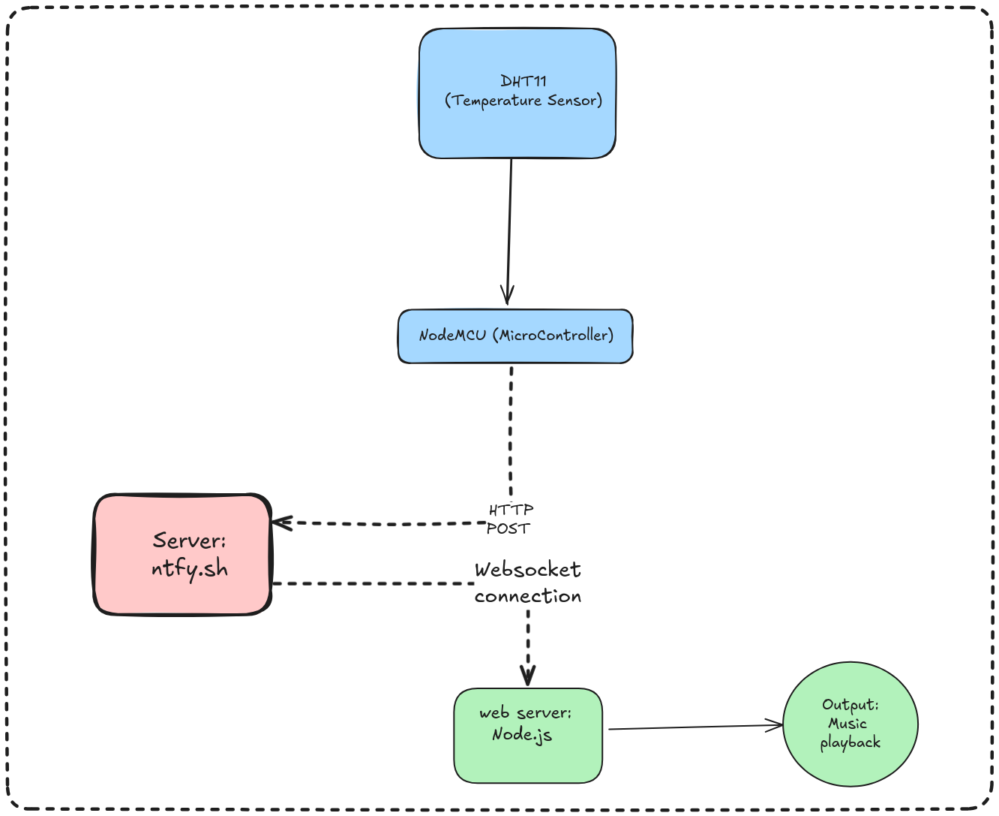

---
<div align="center"></div>

<div align="center">
  <strong>🌡താപസഖി 🎶</strong>
  <p>[pronunciation: Thaa-ba-sa-khi]</p>
</div>

## Basic Details
### Team Name: 🧠 MegaMinds

### Team Members
- Team Lead: **Mohammed Fahad** - Government Engineering College Palakkad
- Member 2: **N Fadeela** - Government Engineering College Palakkad
- Member 3: **Mohammed Muflih** - Government Engineering College Palakkad

### Project Description
A beautiful flawless project that plays melodies according to the subjected temperature 😉

### The Problem (that doesn't exist)
Nobody likes to sense the surrounding temperature by themselves, do they?
So, we made this complicated facade to help you with that 😌

### The Solution (that nobody asked for)
We collect data from a temperature sensor and play accurate melodies for you 🎶

## Technical Details
### Technologies/Components Used
For Software:
- Languages used:
  - Javascript
  - CPP
- Framework ysed:
  - Arduino
  - Node.JS
- Libraries used:
  - Server side: Audic, ws
  - Hardware side: dht11, ESP8266WiFi, WiFiClient
- Tools used:
  - Code Editors: Arduino IDE & Zed
  - Sound editing: Audacity

For Hardware:
- Components:
  - NodeMCU v1 (ESP8266)
  - DHT11 temperature sensor

### Implementation
1. Read data from DHT11 sensor
2. Send the data to [ntfy](https://ntfy.sh)
3. On the PC, establish a web socket to ntfy api.
4. Checking the temperatures, and playing specified audio files

# Installation
Firstly, copy the repo to your local machine:
```
git clone https://github.com/Ranger-NF/Thaapasakhi/
cd Thaapasakhi
```

Now, there are 2 parts to this repo/project: Server (`src/server`) and NodeMCU (`src/microcontroller`). Follow the following steps for each component:
- Server:
```
cd src/server
npm install
```

- NodeMCU:
  - Open `src/mircrocontroller/main/main.ino` file in Arduino IDE
  - Enter missing details:
    1. Enter your Wifi SSID & Password in main.ino (line 5 & 6):
    ```
    const char* SSID = "<ENTER_WIFI_SSID>"; // File: src/microcontrollers/main/main.ino
    const char* password = "<ENTER_WIFI_PASSWORD>";
    ```

    2. Create a topic over at [ntfy](https://ntfy.sh/app) and enter the topic name in main.ino (line 76):
    ```
      String url = "/<ENTER_TOPIC_NAME>"; // File: src/microcontrollers/main/main.ino
    ```

  - Connect NodeMCU board and upload the code


# Run
- Server:
  ```
  cd src/server
  node index.js
  ```

- NodeMCU: Just connect it to power

# Diagrams


*There are 3 parts: Microcontroller, Server(ntfy) and your PC(Node.js web server)*

# Schematic & Circuit


*GND(Ground) pin is connected to GND, VDD pin is connected to 3.3v and Signal pin is connected to D2 of NodeMCU*


# Build Photos


### Project Demo
# Video

https://github.com/user-attachments/assets/027e1072-a8ac-415e-a078-05ecac469b10

*NB: It would be better if you turn up the volume*


## Team Contributions
- Mohammed Fahad: Server side logic, NodeMCU logic
- N Fadeela: Proposed the idea, collected the melodies and documented the project
- Mohammed Muflih: Assembled the circuit, edited audio files and NodeMCU logic

---
Made with ❤️ at TinkerHub Useless Projects


